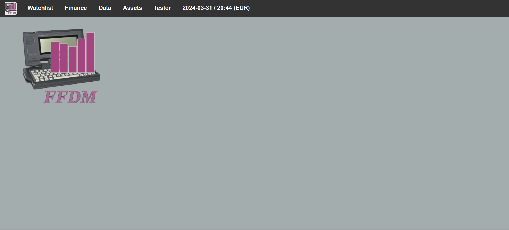
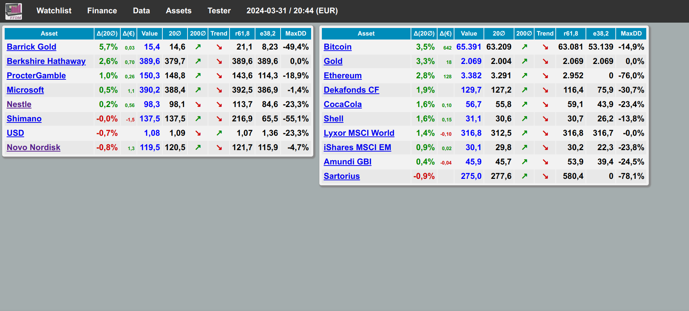
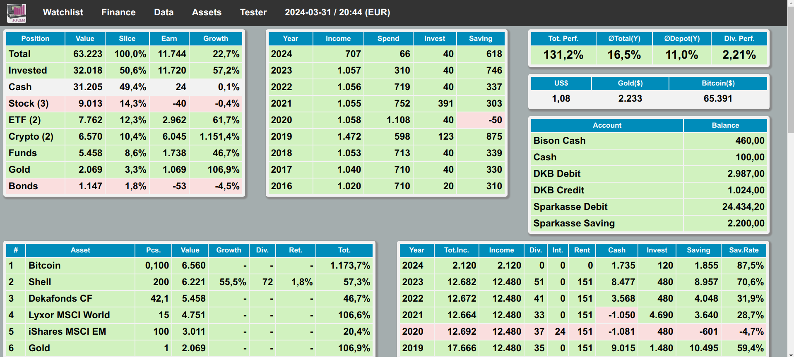
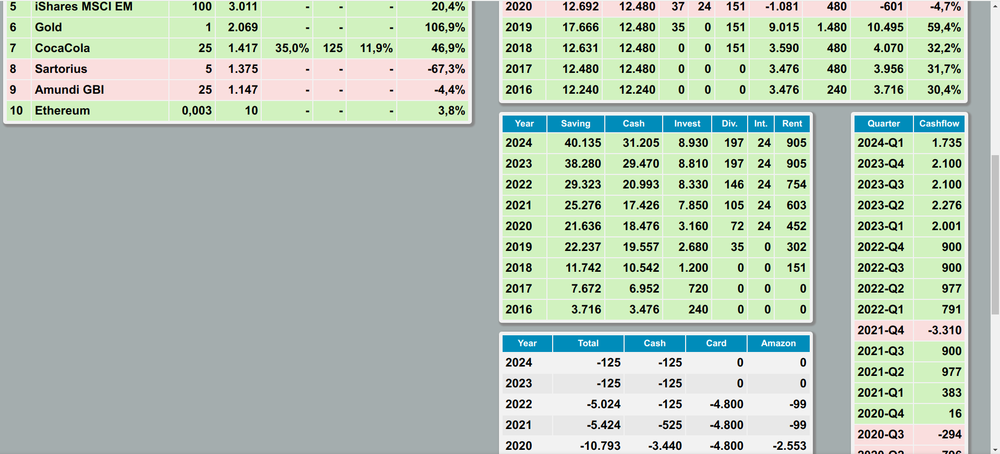
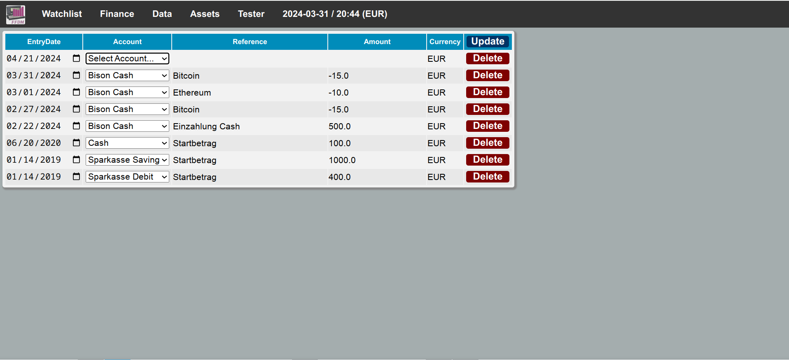
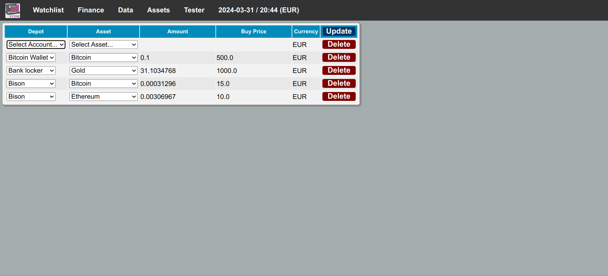
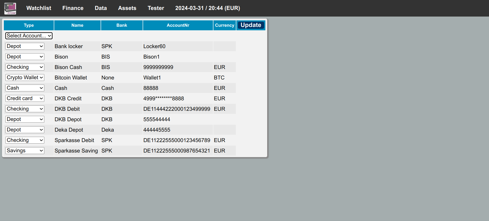
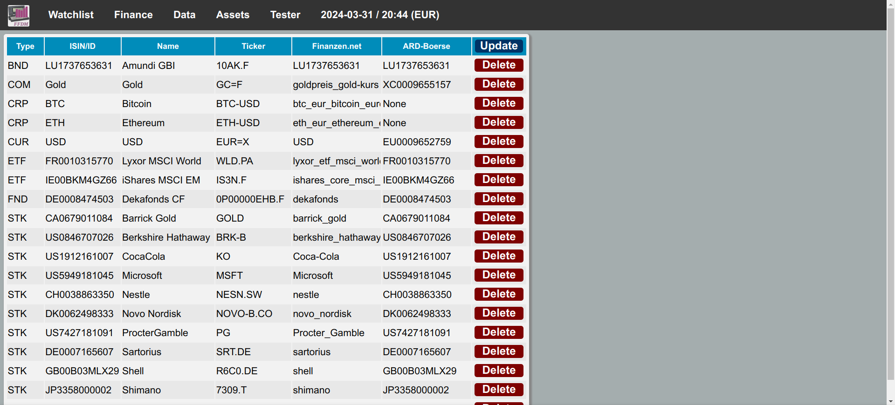
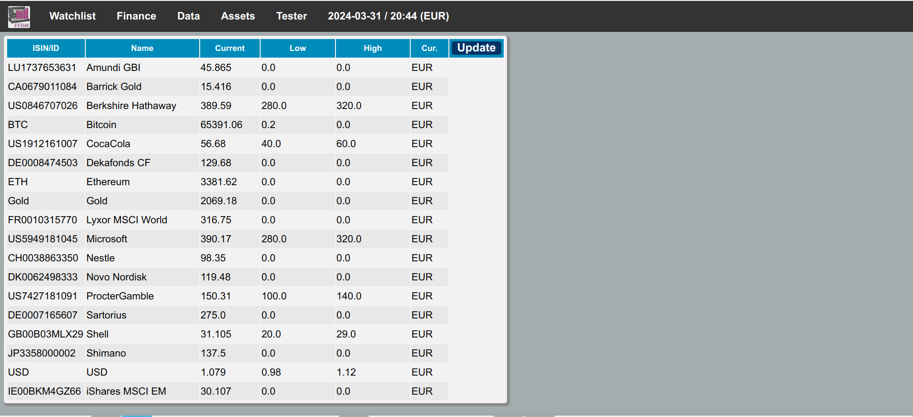

### **FFDM - Free Financial Data Management**

FFDM is a web based financial data management software which display the finance data from data files by DKB and Sparkasse, including DKB depot data. In addition a watchlist for stock, ETF, funds and gold can be managed.

Most parameters can be changed via the web interface. Some initial data still need to be edited in the corresponding CSV files.

Current prices of financial products are retrieved by scraping web pages. The main source is [finanzen.net](http://finanzen.net) and [tagesschau.de](http://tagesschau.de) as a second option.

#### Requirements

All can be met by Linux distributions like Debian 11 or Arch Linux.

* Python 3.9+
* Openpyxl 3.0.3+

#### Parameters for the command line module

```
usage: python ffdm.py [-t] [-w] [-u] [-f] [-a]
                          [-c] [-r] [-b] [-c]

-t, --test      start in test mode 
-w, --web       update finance data from web source
-u, --unlock    delete the lock file
-f, --force     force account data updates
-a, --all       force all data update (web and accounts)
-c, --clean     clean price data from errors
-r, --restore   restore price data from backup file
-b, --backup    back up price data to file
-c, --target    check target prices
```

#### Provided example data

The data files provided contain only generated information not related to any person or organization. However, the example data supports a test of all functions.

### Screenshots

#### Main view



#### Watchlist



#### Finance overview




#### Menu


#### Manual account data



#### Manual depot data



#### Setting up accounts and depots



#### Setting up assets



#### Defining target values for assets


