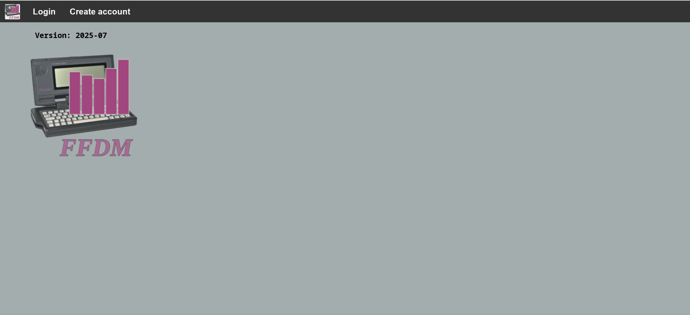
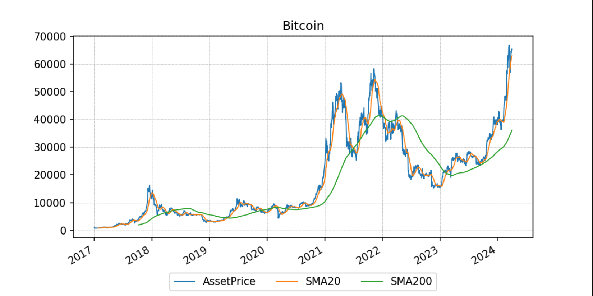

### **FFDM - Free Financial Data Management**


FFDM is a web based portfolio tracker which aggregates the finance data from data files by DKB and Sparkasse, including DKB depot data. In addition, a watchlist for stock, ETF, funds and gold can be managed.

Most parameters can be changed via the web interface. Manual accounts and depots can be directly edited in the web interface or in the corresponding CSV files. CSV files can be uploaded via the web interface. This includes replacing files with different names (a necessity for files from Sparkasse).

Current prices of financial products are retrieved by scraping web pages. The main sources have changed over time because some sources block these requests. Long term price data is downloaded via Yahoo finance.

The logo resembles an Atari Portfolio and a bar chart to represent a portfolio tracker.

#### Requirements

All can be met by Linux distributions like Debian 11 or Arch Linux.

* Python 3.10+
* Pandas
* Flask
* yfinance
* SQLalchemy

#### Parameters for the command line module

```
usage: python ffdm.py [-t] [-w] [-u] [-f] [-a]
                          [-c] [-r] [-b] [-c]

-t, --test      start in test mode 
-w, --web       update finance data from web source
-u, --unlock    delete the lock file
-f, --force     force account data updates
-a, --all       force all data update (web and accounts)
-c, --clean     clean price data from errors
-r, --restore   restore price data from backup file
-b, --backup    back up price data to file
-c, --target    check target prices
```

#### Provided example data

The data files provided contain only generated information not related to any person or organization. However, the example data supports a test of all functions.

Test user 1:
username: test
password: test

A second user is provided to test functions without existing data.

Test user 2:
username: empty
password: empty

In the docker folder is a Dockerfile and scripts to run FFDM within a container. However, some variables need to be defined first. These are emphasized.

### Screenshots

#### Login



#### Main view


#### Indices

Currently only the fear and greed index is provided.


#### Watchlist

The left/first table shows the financial products that have no current investment. The right/second table shows the financial products with current investment. 


#### Charts

Clicking on the current price of a financial product opens a chart in a new browser tab. The charts usually contain data of the last five years before the first data update of this financial product in FFDM. 



#### Finance overview

The first (upper/left) table shows an aggregated overview over all investment classes with the total always at the top. In the middle/second table the monthly average per year of income, spending and saving is shown. On the right are three tables displaying key performance indicators, current prices of important investment products, and the current balance of the managed bank accounts. The key performance indicators are: total performance of all investments, average yearly performance of all investments, average yearly performance excluding crypto currencies, and average yearly dividend yield of all investments.

On the second line, the left table shows a complete list of the investments. The right table contains key performance indicators on a yearly basis. Below the left table shows similar key performance indictors per year on a compounding basis. Beginning right next to the compounding table is a list of quarterly cashflows. The last table contains the yearly spending divided between total, cash payments, card payments, and spending on Amazon.


#### Menu example


#### Manual account data


#### Manual depot data


#### Setting up accounts and depots


#### Setting up assets


#### Defining target values for assets


